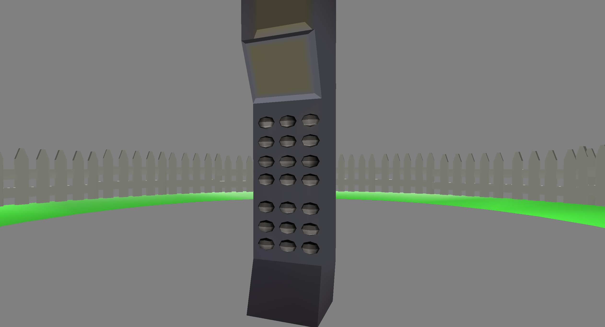

# Just checking in


Author: George Whitfield

Design: Hey! How's it going? Is college going ok? I hope the semester is going well for you. 
I think it's going well for me. Anyways, I'd love to chat with you. Can you please give me a call back?

Screen Shot:



How To Play:

I'd love to chat with you. Can you please pick up the phone?


**  Upsetting Content Warning **
<details>
There is (brief) content involving emotional distress. You might find it disturbing, so please do be careful 


</details>


This game was built with [NEST](NEST.md).

### How to reset the game state
```./dist/game reset```
#### Note: The README.md was modified after the assignment deadline. Please view the most recent commit before the deadline

Sources: 

Door opening/closing sound https://freesound.org/people/amholma/sounds/344360/ (not used)

Phone sounds from
https://freesound.org/people/Breviceps/sounds/466832/
https://freesound.org/people/AnthonyRamirez/sounds/455409/
https://freesound.org/people/MainstreamMex/sounds/439605/
https://freesound.org/people/martian/sounds/575853/